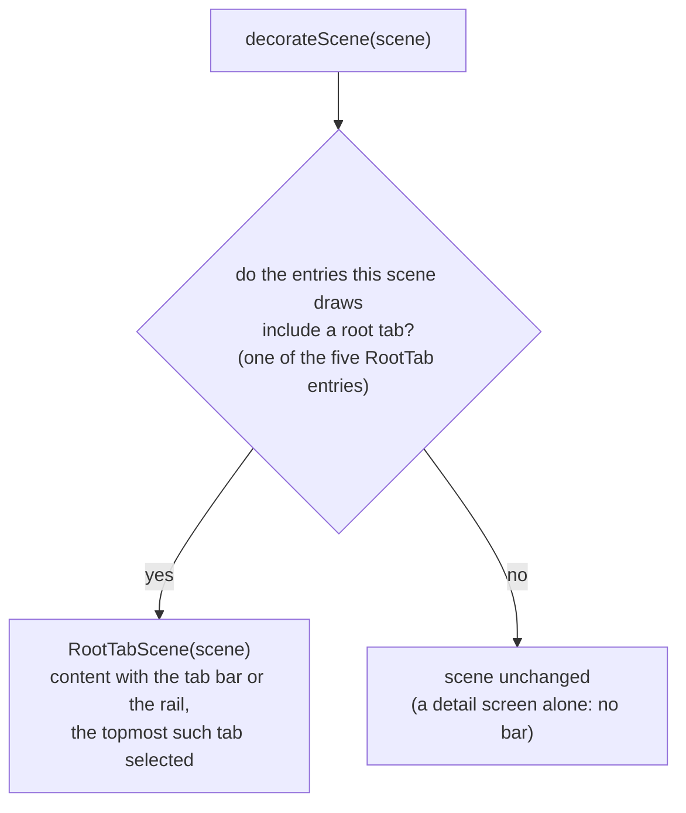

# Root tab bar (RootTabSceneDecorator)

The navigation carrying the root destinations — a bottom bar, or a rail down the leading edge on expanded windows — is added by a Nav3 `SceneDecoratorStrategy` — `RootTabSceneDecorator`, in `:app-shared` — passed to `NavDisplay(sceneDecoratorStrategies = listOfNotNull(rememberRootTabSceneDecorator(…)))`. The list tolerates a null because `rememberRootTabSceneDecorator` returns `null` on iOS, where the bar is native.

## How it is built

`decorateScene` asks which root tab the scene shows: the topmost entry it draws that names one of the five root tabs (`Timetable` / `EventMap` / `Favorites` / `About` / `ProfileCard`, declared by the `RootTab` enum). On a match it returns a scene that adds the bar or the rail to the delegate's content; otherwise it returns the scene **unchanged** — so a detail screen shown on its own has neither.

A scene that draws more than one entry — a [list-detail](./navigation-list-detail.md) scene on an expanded window — keeps its list pane on screen beside the detail above it. That list pane is a root destination, so the destinations stay on screen with its tab selected and another tab remains one tap away; the same detail reached on a compact window is a scene of one entry, matches no root tab, and has no bar.

The wrapper `RootTabScene` overrides `content` — the delegate's content with the bar or the rail added, as [Bar or rail](#bar-or-rail) describes — plus `equals` / `hashCode`, so a scene is reused only while the delegate and the selected tab both hold. Everything else delegates to the decorated scene, so the decoration changes no navigation semantics.

> `NavEntry.key` is private in Nav3, so the decorator cannot read the keys out of `Scene.entries`. It takes the back stack and reads `Scene.entries.size` instead: every scene this app forms draws the topmost entries of the stack, so the count names which keys are on screen. An overlay entry, such as the prize dialog, is the exception: Nav3 forms the scene below it from the entries beneath it. The decorator therefore resolves the keys at the top of the stack through the entry provider and drops the ones whose entry carries `DialogSceneStrategy.dialog()` metadata before counting — the same declaration that makes the entry a dialog in the first place. Counting them in would name the wrong tab, and the scene under the dialog would change identity the moment the dialog opened, blanking the panes it draws.

## Bar or rail

`RootTabScene` reads the window width: from the EXPANDED breakpoint — 840dp and up — a vertical `KaigiNavigationRail` down the leading edge carries the destinations, and anything narrower shows a bottom-aligned `KaigiNavigationBar` (both from `:core:ui`, drawn as the same hand-drawn pill). The switch follows the window width alone, never how many panes the scene draws: a wide window with no detail open still shows the rail.

While the scene draws two panes, a drag handle on the pane boundary — at the right edge of the rail column, centred on the window height — collapses the rail: the column tracks the finger from its full width to zero and settles on release, and the freed width goes to the panes. The handle stays visible while the rail is collapsed, since nothing else brings the rail back, and it leaves the screen with the second pane, so leaving the two-pane layout restores the rail. Whether the rail is collapsed survives a configuration change.

The two occupy space differently:

- The **bar** floats over the content in a `Box` and takes no layout space.
- The **rail** occupies a `KaigiNavigationRailDefaults.columnWidth` column in a `Row`, and the content — both panes of a list-detail scene included — begins after it. The rail is centred in its column on the window height, independent of whatever header the content draws.

The bar keeps clear of the platform's own navigation area — Android's navigation bar, whether three buttons or the gesture pill — by `Modifier.windowInsetsPadding(WindowInsets.navigationBars)`, which moves it up by that inset and leaves `KaigiNavigationBarDefaults.bottomMargin` above whatever the system draws there. The inset is zero on desktop, on the web, and in screenshot tests, where the bar sits on the margin alone.

A scrollable root destination clears whichever is shown by adding `LocalNavigationBarOccupiedHeight.current` to its bottom content padding: the decorator provides `KaigiNavigationBarDefaults.occupiedHeightWithInset` — the bar's own extent plus the inset it moved up by — under the bar, and zero beside the rail, which floats over nothing. Where no provider is installed the composition local reads as `KaigiNavigationBarDefaults.occupiedHeight`, which is what the native bar on iOS needs: UIKit grows that bar's own height by the inset.

## Tab switching

Tab taps are propagated out of the decorator as events; `KaigiApp` turns them into a single `AppNavigator.selectTab(tab.key)` command, so the back stack is still mutated only in `NavigatorEffect`. `SelectTab` **reorders instead of popping** — the deselected tab stays stashed on the stack, keeping its retained state across switches:

- selecting **About** from `[Timetable]` pushes it: `[Timetable, About]`;
- selecting **Timetable** again reorders: `[About, Timetable]` — About survives underneath;
- selecting **About** again: `[Timetable, About]`, with About's state intact.
- selecting the tab that already sits on top reorders nothing — `NavigatorEffect` emits a reselection on `AppNavigator.reselections` instead, which a screen observes through `TabReselectEffect` to scroll its content back to the top.

The selected item reflects the topmost root the current scene shows. Back falls out of the single stack via `NavDisplay`'s `onBack`: it reaches whichever root is stashed directly beneath the top one; from the home root it exits, even with a tab stashed beneath it, because [`RootSceneStrategy`](./navigation-predictive-back-tabs.md) empties its `previousEntries`.

## iOS

On iOS the bar is native: `RootTabBarView`, a `UITabBar` overlaid on the Compose view controller, and `RootTabSceneDecorator` is not applied. Tab taps arrive through `RootTabNavigator` and land in the same `AppNavigator.selectTab` path, so the back-stack semantics above hold unchanged. For details, see [Liquid Glass tab bar](./ios-liquid-glass.md).

Related: [Root NavEntry emulation (RootSceneStrategy)](./navigation-predictive-back-tabs.md) · [Architecture overview](./architecture-overview.md) · [Entry retention (RetainNavEntryDecorator)](./navigation-retain-entry-decorator.md)
